# OWASP Java - Vulnerability Showcase


A **seriously flawed** Java project for teaching [OWASP Top 10 - 2017](https://www.owasp.org/images/7/72/OWASP_Top_10-2017_%28en%29.pdf.pdf) concepts.

```
DO NOT USE ANY PART OF THIS CODE IN PRODUCTION.
```

## Getting Started

These instructions will get you a copy of the project up and running on your local machine for development and testing purposes.

### Prerequisites

You'll need:

* [JDK 11](https://www.oracle.com/javadownload). I used  version "11.0.5" 2019-10-15 LTS.
* [Payara Server](https://www.payara.fish/software/downloads/). I used version Payara Server 5.193.1 Full.
* [MySQL Community Server 8](https://dev.mysql.com/downloads/mysql/). I used MySQL Community Server 8.0.18.
* [MySQL Connector/J 8](https://dev.mysql.com/downloads/connector/j/). I used "Platform Independent," version 8.0.18.
* [IntelliJ IDEA](https://www.jetbrains.com/idea/). Not a prerequisite per se, but it would be hard to work with the project without it. I used IntelliJ IDEA 2019.2.3.

#### JDK 11
Install JDK, and configure environment variables `JAVA_HOME` and `PATH` properly. Some guidelines are provided in [this Stackoverflow post](https://stackoverflow.com/q/1672281/459391).

Open a command prompt, and make sure everything works smoothly:

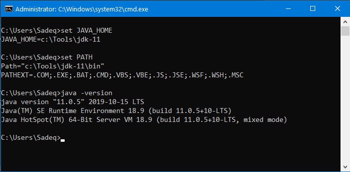

#### MySQL Community Server 8
Unzip MySQL, and go to the `bin` directory. Execute the following command (*not recommended* for production environments):
```
mysqld --initialize-insecure
```

This command initializes the data directory, and creates a `'root'@'localhost'` superuser account with empty password.

To install the service on Windows machines, run:
```
mysqld --install
```

Finally, to start the service, run:
```
sc start mysql
```

To check whether the installation was successful, issue the command `mysql -uroot`: 
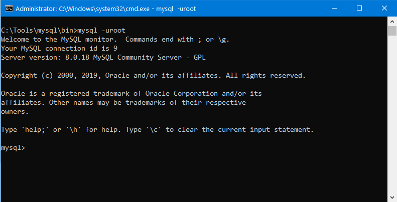

Type `exit`, and press `Enter` to get out of MySQL console.

We need to create our sample database, and populate it with sample data. The SQL file is called [testdb.sql](extra/testdb.sql). Download it to MySQL `bin` directory, and from there execute the following command:
```
mysql -uroot < testdb.sql
```

If everything goes smoothly, you can issue the commands and see the results as shown below: 

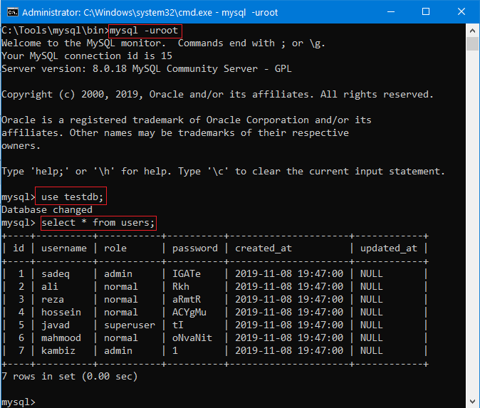

Finally, change the `root` password to `123456`, as empty passwords will not be accepted by Payara Server (next step). Notice that the password itself, as well as the following method for changing the password, are **totally insecure**:
```
mysqladmin --user=root password "123456"
``` 

#### Payara Server
Download and extract Payara Server, as well as MySQL Connector/J. I extracted the latter to `C:\tmp\mysql-connector-java-8.0.18.jar`.

Make sure you followed the instructions for installing and configuring JDK-11. Start Payara Server using the following command:
```
asadmin start-domain
```

Next, install MySQL Connector/J:
```
asadmin add-library C:\tmp\mysql-connector-java-8.0.18.jar
```

Here's a snapshot of how things should look like:

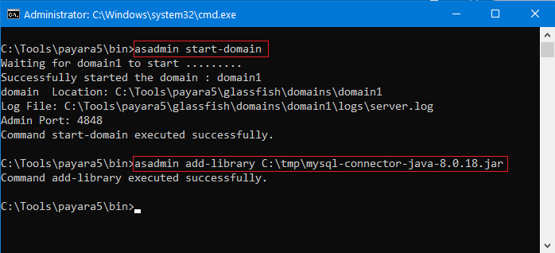

Open [Payara Web Console](http://localhost:4848/), and navigate to `Resources → JDBC → JDBC Connection Pools`. Click the `New` buttton.

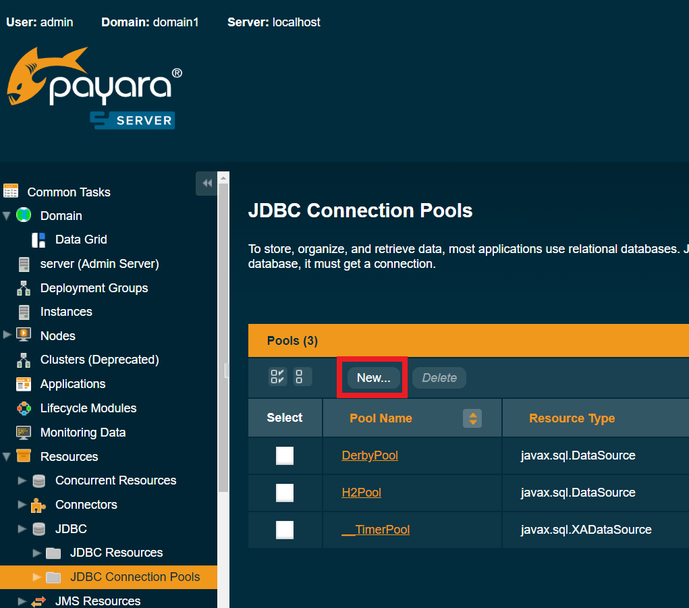

For Step 1, fill in the information exactly as follows:

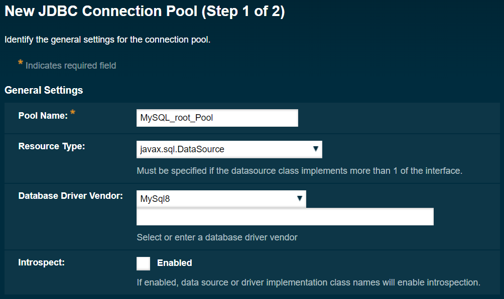

For Step 2, scroll down until you see the `Additional Properties`:


You have to set the following properties (sorted alphabetically):

* `allowPublicKeyRetrieval` – Whether the client is allowed to automatically request the public key from the server. Set to `true`. (Not recommended in production environments)
* `DatabaseName` – The name of the database you want to connect to. In this case, `testdb`.
* `Password`: The password for the specified user. Here, it's `123456`.
* `ServerName`: The location of the MySQL server. In this case `localhost`.
* `sslMode`: Whether SSL is used for connecting to MySQL server. Set it to `DISABLED`. (Not recommended in production environments)
* `URL` and `Url`: The JDBC URL to be used. Here, set it to `jdbc:mysql://localhost:3306/testdb`.
* `User`: The username for connecting to the database. Here, it's `root`.

Hit the `Finish` button. Click the newly created connection pool. In the `General` tab, click the `Ping` button. If everything goes right, you should see the following:


Similarly, create another connection pool called `MySQL_readonly_Pool`. The Step 1 is the same as the previous connection pool. For Step 2, set the `Additional Properties` as follows:

* `allowPublicKeyRetrieval: true`.
* `DatabaseName:            testdb`.
* `Password:                MyVeryLongPassphrase`.
* `ServerName:              localhost`.
* `sslMode:                 DISABLED`.
* `URL:                     jdbc:mysql://localhost:3306/testdb`.
* `Url:                     jdbc:mysql://localhost:3306/testdb`.
* `User:                    readonly`.

We need to set up the JDBC resources. Go to `Resources → JDBC → JDBC Resources`, and click `New`. Fill in the form as follows:

* `JNDI Name: jdbc/MySQL_root_DataSource`
* `Connection Pool: MySQL_root_Pool`

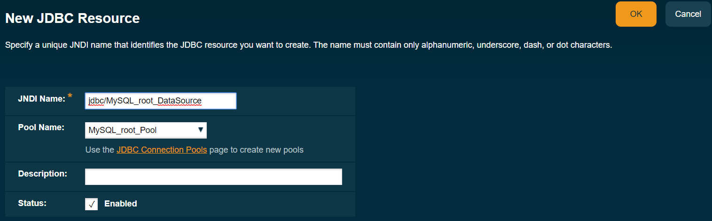

Similarly, do this for the second connection pool:
* `JNDI Name: jdbc/MySQL_readonly_DataSource`
* `Connection Pool: MySQL_readonly_Pool`

Finally, issue the following command to stop the Payara Server. 
```
asadmin stop-domain
```
This is done since IntelliJ IDEA automatically starts the server.

#### IntelliJ IDEA
Open the project in IntelliJ IDEA. It notifies you that `Web framework is detected`:

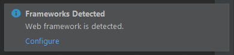

Click `Configure` to open the `Setup Frameworks` window. Then, simply click OK:

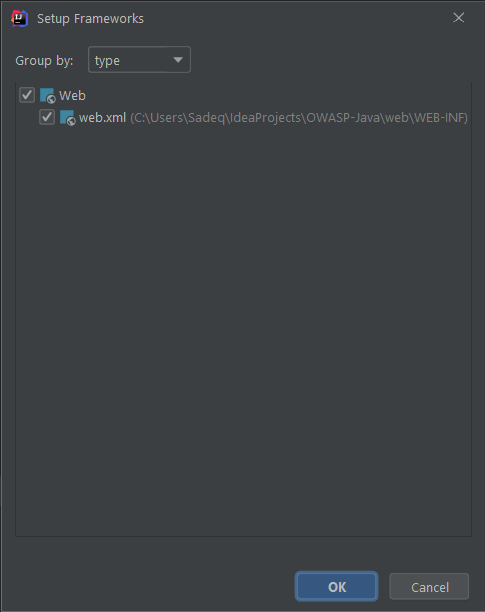

Select `Run → Edit Configurations...`. Open  `Templates → GlassFish Server → Local`. Click `Configure`:

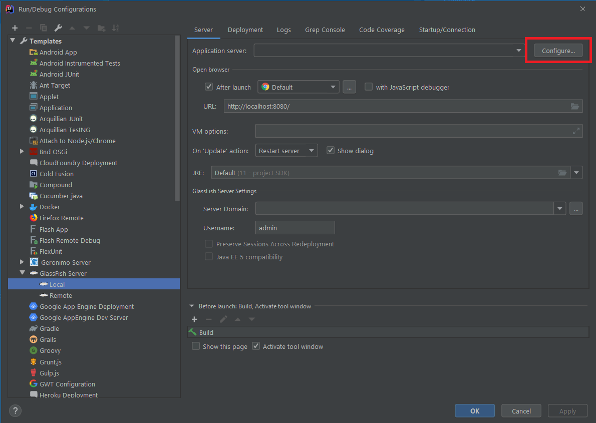

Select `GlassFish Home`. If selected correctly, IntelliJ will automatically detect the `GlassFish Version`:

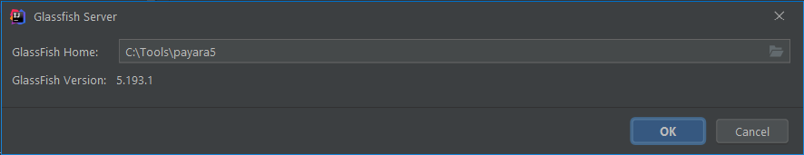

Click `OK`. From the `Server Domain` drop-down box, select `domain1`.


Click `Apply`. You now have a proper GlassFish template which you can use across multiple projects. But for each project, you need to configure the "artifact" to be deploed. To this end, click the `+` at the top-left, and select `GlassFish Server → Local`:

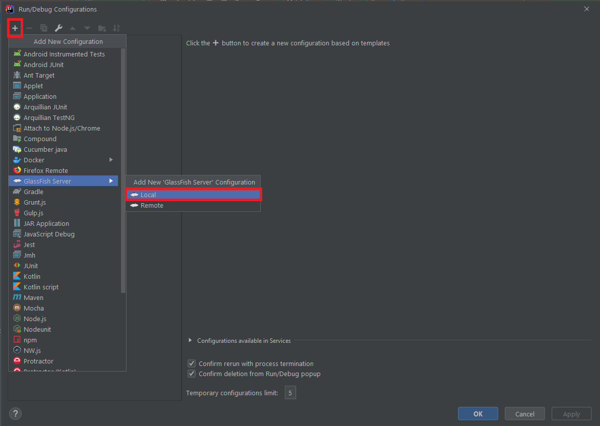

In the bottom, IntelliJ warns you that `No artifacts configured`. Simply click on the `Fix` button.

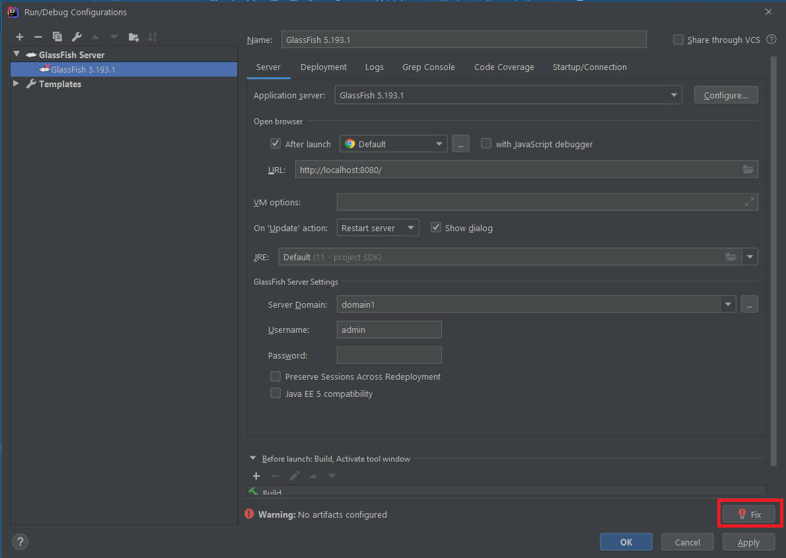

Then, in the `Artifacts` window, click on the `+` sign, and choose `Web Application Exploded → From Modules`

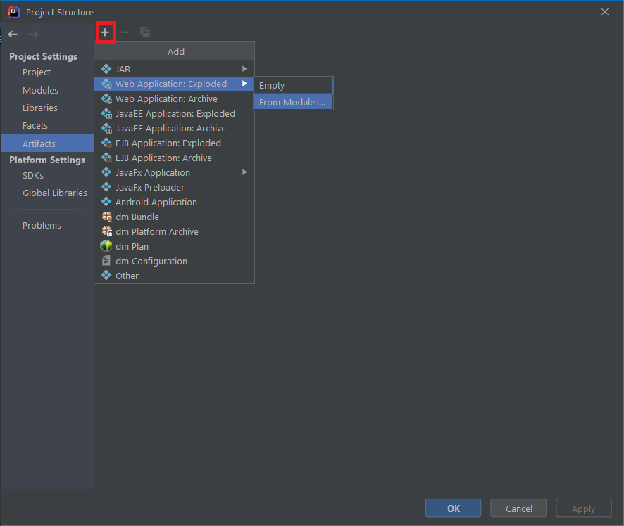

Pick the only available module, i.e., `OWASP-JAVA`, and click OK.

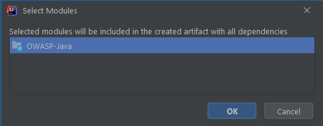

Click OK to return to the `Run/Debug Configurations`. At the bottom, you'll see one more warning: `Debug settings are invalid or not suitable for local debugging`. Click the `Fix` button, and IntelliJ will take care of that for you.

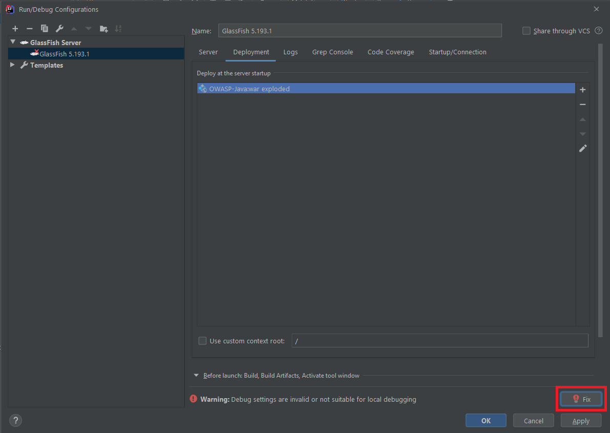

You can now run the project. IntelliJ automatically opens your default browser, and navigates to `http://localhost:8080/OWASP_Java_war_exploded/`:

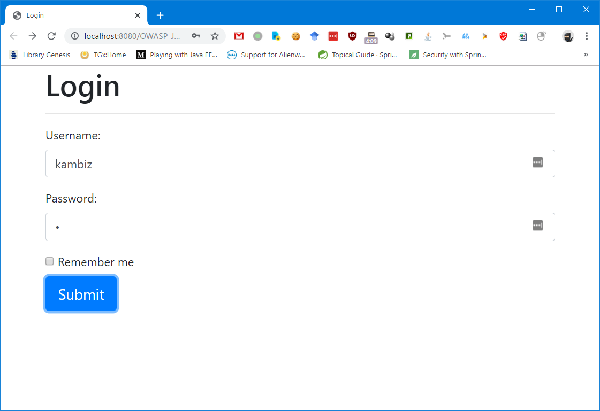

Enter the following credentials:
* Username: `kambiz`
* Password: `1`

If everything works correctly, you'll be redirected to the user home page:

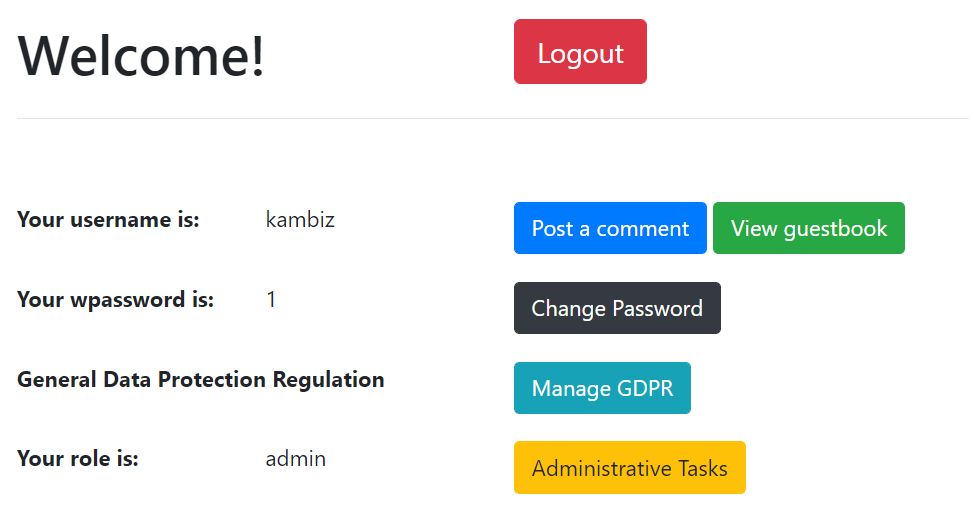

Otherwise, you might need to look at GlassFish logs, as reported by IntelliJ, to see what went wrong.

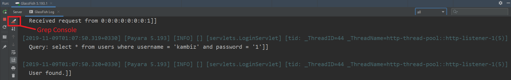

By the way, I use the [Grep Console](https://plugins.jetbrains.com/plugin/7125-grep-console) plugin for analyzing logs easier.
